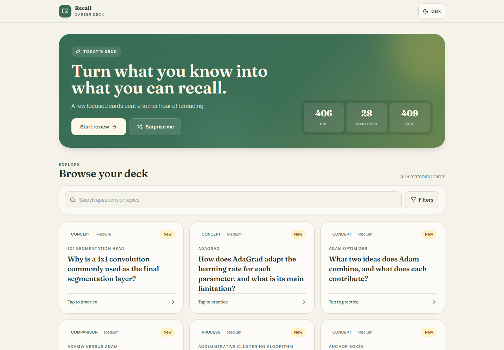
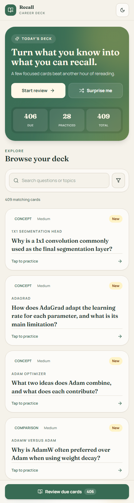
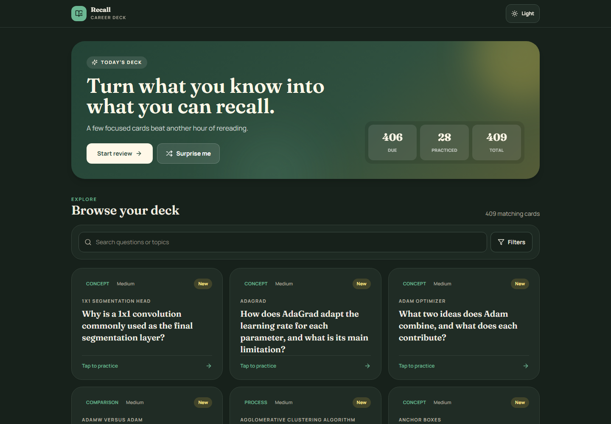
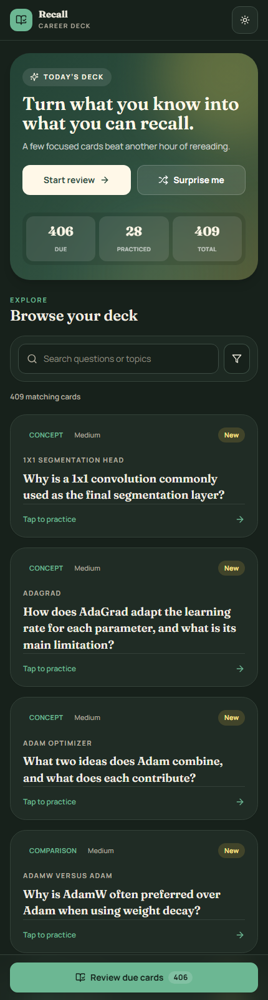
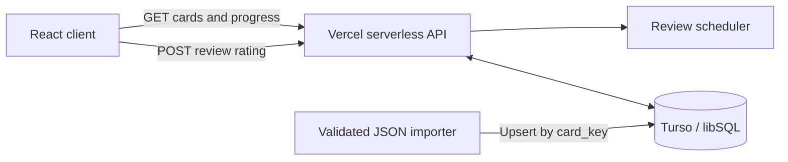

# Career Flashcards

A focused study app for turning technical notes into structured flashcards, reviewing them through an adaptive schedule, and keeping progress synchronized across sessions.

**Live app:** [flashcards-omega-swart.vercel.app](https://flashcards-omega-swart.vercel.app/)

## The interface

The dashboard puts the next study action first: learners can see their progress, search or filter the collection, and open any card directly. The same experience adapts to a compact single-column layout on mobile. Click a screenshot to view it at full resolution.

<table>
  <tr>
    <th colspan="2">Light mode</th>
  </tr>
  <tr>
    <td width="78%" align="center" valign="top">
      <a href="./docs/images/flashcards-light-desktop.png">
        
      </a>
      <br />
      <sub><strong>Desktop:</strong> progress summary, study actions, filters, and the card collection remain visible together.</sub>
    </td>
    <td width="22%" align="center" valign="top">
      <a href="./docs/images/flashcards-light-mobile.png">
        
      </a>
      <br />
      <sub><strong>Mobile:</strong> the same workflow becomes a focused, scrollable single column.</sub>
    </td>
  </tr>
  <tr>
    <th colspan="2">Dark mode</th>
  </tr>
  <tr>
    <td width="78%" align="center" valign="top">
      <a href="./docs/images/flashcards-dark-desktop.png">
        
      </a>
      <br />
      <sub><strong>Desktop:</strong> the complete study workspace with the lower-contrast dark palette.</sub>
    </td>
    <td width="22%" align="center" valign="top">
      <a href="./docs/images/flashcards-dark-mobile.png">
        
      </a>
      <br />
      <sub><strong>Mobile:</strong> the responsive layout and theme carry through on smaller screens.</sub>
    </td>
  </tr>
</table>

## What the project demonstrates

Career Flashcards is more than a static card gallery. It combines a responsive React interface, a serverless API, durable review history, and a lightweight spaced-repetition scheduler.

- Search and filter cards by category, topic, subtopic, card type, and difficulty.
- Prioritize cards that are due for review.
- Study in a focused card dialog with keyboard navigation.
- Reveal detailed answers, key points, follow-up questions, and common mistakes.
- Rate each review as Again, Hard, Good, or Easy.
- Persist review counts, lapses, intervals, and due dates in Turso.
- Preserve filters locally and support light and dark themes.
- Import curated flashcard batches through a validated, idempotent workflow.

## How the system works



The browser loads flashcards and progress through TanStack Query. Vercel functions validate requests and call a shared database layer. When a learner rates a card, the scheduler calculates its next interval and the API upserts the result into `flashcard_progress`. New card collections enter through a separate importer, so content updates do not require a frontend deployment.

### Review scheduling

| Rating | First interval | Later behavior |
| --- | ---: | --- |
| Again | 10 minutes | Resets the day interval and records a lapse |
| Hard | 1 day | Grows the previous interval by roughly 1.5× |
| Good | 3 days | Grows the previous interval by roughly 2.5× |
| Easy | 7 days | Grows the previous interval by roughly 3.5× |

## Stack

| Layer | Technology |
| --- | --- |
| Frontend | React 18, TypeScript, Vite |
| Data fetching | TanStack Query |
| UI | Tailwind CSS, Radix UI, Lucide icons |
| API | Vercel Functions |
| Database | Turso / libSQL |
| Deployment | Vercel |

## Project structure

```text
api/                          Vercel API routes
src/pages/FlashcardsPage.tsx  Main browsing and review experience
src/server/database.ts        Turso queries and progress persistence
src/server/reviewSchedule.ts  Scheduling rules
src/types.ts                  Shared application types
scripts/import-flashcards.mjs Validated JSON-to-Turso importer
scripts/generate-taxonomy-mapping.mjs  Complete card-level taxonomy classifier
scripts/refine-taxonomy-mapping.mjs    Compact taxonomy rules and validation
scripts/migrate-flashcard-taxonomy.mjs  Verified Turso taxonomy migration
data/flashcard-taxonomy-mapping.json    Reviewed topic/subtopic mapping
docs/images/                  UI screenshots used by this README
```

## Add or update flashcards

Put the Turso credentials in the repository's ignored `.env` file:

```env
TURSO_DATABASE_URL=libsql://your-database.turso.io
TURSO_AUTH_TOKEN=your-token
```

Prepare a JSON file with a top-level `cards` array. Each card must contain:

- `card_key`, `card_type`, `category`, `topic`, `subtopic`, `difficulty`, `front`, and `answer` as non-empty strings
- `key_points`, `follow_up_questions`, and `common_mistakes` as arrays of strings
- `needs_review` as a boolean
- Optional `source_reference`, `review_reason`, and integer `question_id` values

Validate a file without changing Turso:

```bash
npm run import:flashcards -- path/to/cards.json --dry-run
```

Import it:

```bash
npm run import:flashcards -- path/to/cards.json
```

The importer upserts cards by `card_key`: new keys are inserted and existing keys are updated. Review history is kept because existing card rows retain their IDs. Re-running the same import is safe.

The importer also removes generated `:chatgpt-content-reference{...}` markers, which are not useful card content. Other malformed JSON is rejected before Turso is changed.

## Apply the reviewed taxonomy mapping

Regenerate the mapping from the flashcard API, then compact it into the controlled 17-topic catalog:

```bash
npm run generate:taxonomy
```

The compact taxonomy permits at most six topics per category and three to seven dependent subtopics per topic. Generation fails if a card is unclassified, a mapping rule is unused, a topic has fewer than five cards, or those menu-size bounds are exceeded.

Validate the mapping against every live card without changing Turso:

```bash
npm run migrate:taxonomy -- --dry-run
```

Apply the schema and data migration:

```bash
npm run migrate:taxonomy
```

The migration adds `subtopic` when needed, updates cards by `card_key` and current `id`, and verifies that card identities, review-history attachments, and all mapped taxonomy values remain intact. It is safe to rerun after a successful migration.
